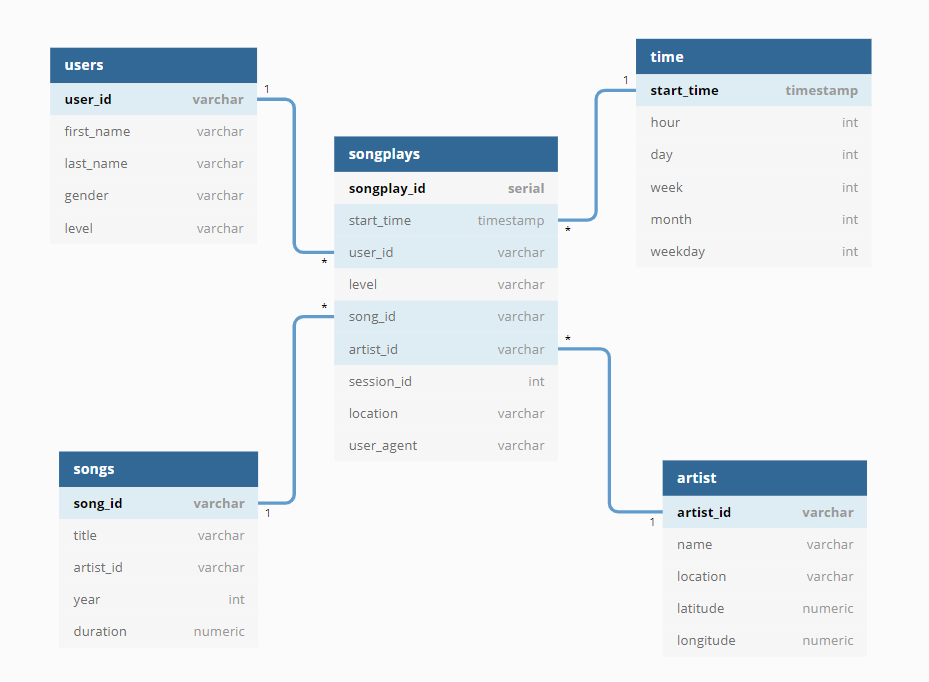

## Project: Data Modeling with Postgres




## Introduction
A startup called Sparkify wants to analyze the data they've been collecting on songs and user activity on their new music streaming app. The analytics team is particularly interested in understanding what songs users are listening to. Unfortunately, they don't have an easy way to query data for their analytics needs. 

## Project description 
As a data engineer, you have to design a Postgres database for storing fact and dimensional tables. Database tables should be derived from directories of JSON logs on user activity and metadata on the songs in the app. In order to extract data from JSON and write them to Postgres, ETL pipeline should be written.

**tech stack**: postgres, python, sql, pandas, 

## Project implementation
Fact and dimensional tables were defined in a star schema and focused on analysing played songs, which is the core focus of the analytics team in Sparkify. Start schema is perfectly suited for this purposes since it's allowing to construct efficient queries with small amount of joins. ETL pipeline designed using **pandas** library, that allows to read data from JSON and perform necessary filtering and adjustments prior to writing into the database, and **psycopg2** library which was used for creating database tables in Postgres.   

### Project structure
    
    1-modeling-with-postgres/
    ├── create_tables.py         # creates tables predifined in sql_queries.py
    ├── etl.ipynb                # notebook that showcase ETL steps for each table
    ├── etl.py                   # general ETL script that using  whole dataset
    ├── output_file.zip          # zipped  dataset
    ├── sql_queries.py           # create, drop, insert, select queries for defined tables
    └── test.ipynb               # notebook that testing query results of etl.ipynb

To represent results you should run scripts in the following order:
1. Create posgres tables using:
    ```
    python create_tables.py
    ```
2. Execute ETL pipeline using:
    ```
    python etl.py
    ```
**Note:** don't forget to extract data from the zip archive. 

### Query examples

- Number of male users: 
```sql
SELECT COUNT(users.first_name) FROM users WHERE users.gender='M' 
```

- Top 10 longest songs: 
```sql
SELECT songs.title, songs.duration FROM songs ORDER BY songs.duration DESC LIMIT 10 
```

- Top 10 most popular songs: 
```sql
SELECT songs.title, COUNT(songs.title) FROM (songplays JOIN songs ON songplays.song_id=songs.song_id) GROUP BY songs.title
```
