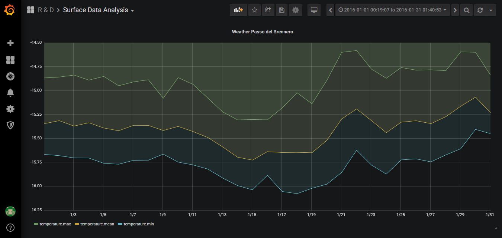

# Global Surface Summary Dashboard

### Data Engineering Capstone Project


#### Project Summary

The goal of this project is to build an analytics dashboard for surface summary
data from climate stations worldwide. The dashboard should be easily accessible
for multiple users and allows to analyse temporal dynamics of the climate data.


### 1. Scope and data

#### Scope

This project focused on building analysis of climate data parameters which located
worldwide. The climate data is processed using ad-hoc ETL job, uploaded to the database and
visualized in the dashboard application. The dataset used in this project available
at [Kaggle](https://www.kaggle.com/noaa/noaa-global-surface-summary-of-the-day).

The total solution is a containerized application using Docker, which consist of the following components:
- Influx DB - optimized time-series database
- Grafana - state-of-the-art tool for dashboarding of time-series data


#### Describe Data

The Kaggle dataset contains surface summary data from 1929 until 2019 from over 9000
climate stations worldwide. The daily elements included in the dataset
(as available from each climate station) are:

- Mean temperature
- Mean dew point
- Mean sea level pressure
- Mean station pressure
- Mean visibility
- Mean wind speed
- Maximum sustained wind speed
- Maximum wind gust
- Maximum temperature
- Minimum temperature
- Precipitation amount
- Snow depth

**Note:** For this project we focus on the temperature data (mean, max, min).


### 2. Data exploration and Assessment

There are several prominent data quality issues in the dataset, which needs to
be handled before processing.

- missing data (station number, station measurements, station country, etc.)
- duplicate data (same station number for several stations in different countries)
- not proper units of measurements (e.g. we need to cast Fahrenheit to Celsius)

To clean this data the following steps performed:

- unique station id should be designed to overcome duplicate and missing station number and wsban data
- all stations that can't be linked to the country should be discarded
- temperature data should be converted to proper units

The more detailed process described in the *notebooks/prepare_metadata.ipynb* and
*notebooks/dataflow-example.ipynb*.


### 3. Data model

#### Conceptual Data Model

In this project, I am working with time-series data, which required some special
treatment. To store this data efficiently it's required to use databases
specifically designed for. After doing some research, I decided to use
[InfluxDB](https://docs.influxdata.com/influxdb/v1.8/), which
is stated to be the best on the market at the moment, e.g. compared to MongoDB
it can provide:

- 3.9x better data ingestion
- 16.6x better compression
- 16% better query performance

To design the data model, we need to address the definition of key concepts
such as fields, tags and measurements.

- **Fields** is the key-value pairs in an InfluxDB data structure that record
metadata and the actual data value. Fields are required in InfluxDB data structures
and they are not indexed - queries on field values scan all points that match the
specified time range and, as a result, **are not** performant relative to tags.

- **Tags** is the key-value pair in the InfluxDB data structure that records
metadata. Tags are an optional part of the data structure, but they are useful
for storing commonly-queried metadata; **tags are indexed** so queries on tags
are performant.

- **Measurements** is the part of the InfluxDB data structure that describes
the data stored in the associated fields. Measurements are strings.

Taking into account above-mentioned concepts our data will be organized into
InfluxDB database with into the following measurement:

- measurement: temperature
    - fields: mean, max, min temperatures
    - tags: station id, country, station name

#### Mapping Out Data Pipelines

The necessary steps to pipeline data into the provided model are the following:


- extract zipped Kaggle Dataset
- read and clean .op files which contains measurement for a particular year
- transform .op files into a pandas data frame
- upload pandas data frame into influxdb measurement using influxdb python client library

**Note:** after this steps Influx DB should be connected to the Grafana instance,
following [this guide](https://grafana.com/docs/grafana/latest/features/datasources/influxdb/).

**Note:** All components were executed in Docker environment, which can be recreated
using docker-compose file in *infrastructure/infrastructure.yaml*


### 4. Running ETL pipeline

- Setup the environment using docker-compose:

```
docker-compose -f infrastructure/infrastrucuture.yaml up -d
```

- Follow the steps in *notebooks/dataflow-example* to process .op files

- Data dictionary example provided in *data/data_dict.json*
(explanation for data dictionary provided above in Data model section)

**Note:** Dataset at Kaggle currently updated on the year basis (last measurements are from 2019),
however, it will be better to update it at least daily which allows having more
up to date data and ability to react on climate changes.


### Resulting Grafana dashboard

Please find an example of a developed dashboard below. I combined several years
data from several cities into a set of panels into a single dashboard.




## Q&A

How you would approach the problem differently under the following scenarios?

1. - If the pipelines were run daily by 7 am?
   - For this, I will incorporate some workflow management system
   (e.g. **Airflow**), that allows to schedule pipelines at a convenient time.

2. - If the data was increased by 100x?
   - Current installation of InfluxDB allows handling 100x data increase, however
   with more expansion, it's preferably to move into cloud-managed version,
   with [elastic scalability support](https://www.influxdata.com/products/influxdb-cloud/).

3. - If the database needed to be accessed by 100+ people?
   - In case of growing user base it's possible to increase the amount of Grafana instances and [put a load balancer in front](https://grafana.com/docs/grafana/latest/administration/set-up-for-high-availability/).
   Access to the database will not be a problem for 100 users, due to speed that Influx DB can provide.
